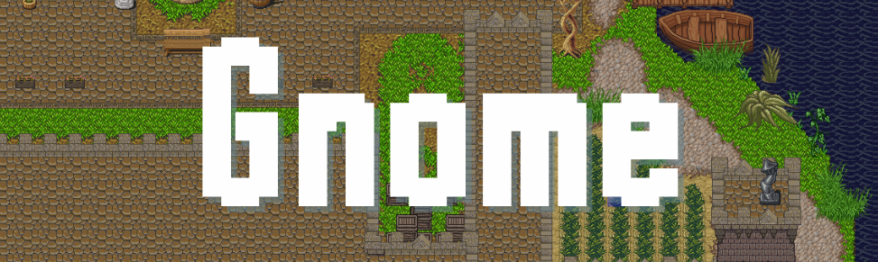

## Objective of the project

This project is part of a training program at GRETA de Pau in France.
The goal is to create an object-oriented mini-game.

## Rules

- only classes
- no jQuery

 ## Gameplay

The goal of the game is to kill you in the time. You win a little time and kill monster and give yourself a little more time.

You can move using arrow keys and start or restart the game by pressing space.

<a href="https://josuedavidurand.github.io/Gnome/">

  

</a>

### todos

- [ ] document the readme
- [ ] add the time suport
- [ ] fix the bug where the hero can be initialized on a bomb at the start of the game
- [ ] add the ATH
- [ ] add the sound
- [ ] add bomb animation
- [ ] fix the restart : the  game requires reloading the page to do another game